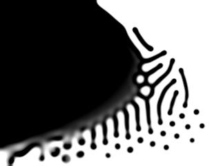

# Reaction Diffuction Simulation Using Grey-Scott Model 

## Useful links

* [ReactionDifusion Tutorial](https://www.karlsims.com/rd.html) by Karl Sims
* [Pearson's Classification](http://mrob.com/pub/comp/xmorphia/pearson-classes.html)